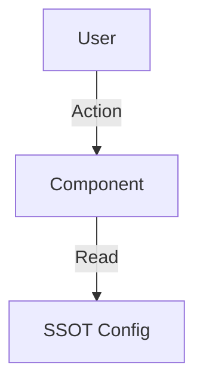

# [Topic Name] SSOT

> **SSOT Key**: `topic.unique_key` (e.g., `platform.auth`, `db.postgres`)
> **核心定义**：一句话定义该话题的单一真理来源是什么。

---

## 1. 真理来源 (The Source)

> **原则**：文档解释“为什么”，代码/基础设施定义“是什么”。不要在文档里硬编码易变的值。

本话题的配置和状态由以下物理位置唯一确定：

| 维度 | 物理位置 (SSOT) | 说明 |
|------|----------------|------|
| **代码定义** | `[path/to/file.tf](../../path/to/file)` | 架构与资源的声明源头 |
| **运行时状态** | **Vault** (`secret/data/...`) | 密钥与敏感配置的运行时真理 |
| **策略约束** | `[policy.rego](../../path/to/policy)` | 自动化的合规性检查 |
| **环境变量** | `[env.ci](../../tools/envs/env.ci)` | 变量契约 |

### Code as SSOT 索引

<!-- 关键：不要复制全部代码。列出关键逻辑的文件入口，让开发者去代码里看细节 -->

- **核心逻辑实现**：参见 `[src/core/logic.py](../../src/core/logic.py)`
- **Schema 定义**：参见 `[schema.graphql](../../libs/schema/schema.graphql)`
- **默认配置值**：参见 `[variables.tf](../../variables.tf)` (搜索 `variable "xxx"`)

---

## 2. 架构模型

<!-- 使用 Mermaid 描述组件关系、数据流向或层级依赖 -->



### 关键决策 (Architecture Decision)

- **决策点 1**：为什么选择 X 而不是 Y？
- **依赖关系**：本模块依赖 `L1 Bootstrap` 的 [xxx] 能力。
- **豁免规则**：是否存在打破 SSOT 的情况？(例如 Trust Anchor)

---

## 3. 设计约束 (Dos & Don'ts)

> **目的**：定义设计边界，作为 Code Review 的依据。

### ✅ 推荐模式 (Whitelist)

- **模式 A**：推荐使用 `resource "random_password"` 生成非关键密钥，并存入 Vault。
- **模式 B**：所有 L4 应用**必须**通过 Vault Agent 注入密钥，禁止使用环境变量传递敏感信息。

### ⛔ 禁止模式 (Blacklist)

- **反模式 A**：**严禁**在 Git 代码中提交 `.env` 文件或包含明文密码。
- **反模式 B**：**禁止**手动修改 K8s Secret，必须通过 Vault 或 External Secrets Operator 同步。

---

## 4. 标准操作程序 (Playbooks)

<!-- 列出具体的运维场景。SOP 不应是通用的，应针对具体任务。 -->

### SOP-001: [任务名称，如：轮换数据库密码]

- **触发条件**：每 90 天 / 发生泄露事件
- **执行者**：DevOps 工程师 / 自动化 Pipeline
- **步骤**：
    1. 触发轮换指令：`vault write -f secret/data/postgres/rotate`
    2. 验证新密码生效：`[check_db.sh](../../tools/ops/check_db.sh)`
    3. 重启相关 Pod（如需）：`kubectl rollout restart deployment/myapp`

### SOP-002: [任务名称，如：紧急扩容]

- **触发条件**：CPU 使用率 > 80% 持续 10分钟
- **步骤**：
    1. 修改 `variables.tf` 中的 `node_count`。
    2. 提交 PR 并评论 `/apply`。
    3. (紧急情况) 手动 `terraform apply` 并事后补 PR。

---

## 5. 验证与测试 (The Proof)

> **闭环原则**：如果 SSOT 声称系统具备某项能力，必须有对应的 E2E 测试证明它。

本文档描述的行为由以下测试用例守护：

| 行为描述 | 测试文件 (Test Anchor) | 覆盖率 |
|----------|-----------------------|--------|
| **核心功能验证** | `[test_auth_flow.py](../../e2e_regressions/tests/platform/auth/test_auth_flow.py)` | ✅ Critical |
| **异常恢复验证** | `[test_recovery.py](../../e2e_regressions/tests/ops/recovery/test_recovery.py)` | ⚠️ Partial |
| **配置合规性** | `[check_policy.rego](../../tools/checks/check_policy.rego)` | ✅ 100% |

**如何运行验证**：
```bash
# 运行相关 E2E 测试
pytest e2e_regressions/tests/platform/auth/ -v
```

---

## 引用指南 (How to Reference)

在其他文档（如 README 或设计文档）中引用 SSOT 时，请使用标准格式：

- **引用整体架构**：
  > 详见 [**Auth SSOT**](./path/to/platform.auth.md)。
- **引用特定 SOP**：
  > 执行 [**SOP-001: 轮换密钥**](./path/to/platform.auth.md#sop-001-轮换数据库密码)。
- **引用设计约束**：
  > 根据 [**Auth SSOT / Blacklist**](./path/to/platform.auth.md#禁止模式-blacklist)，禁止提交 .env 文件。

---

## Used by

> **Note**: 本章节由 MkDocs 插件自动维护反向链接 (Backlinks)，无需人工编辑。
