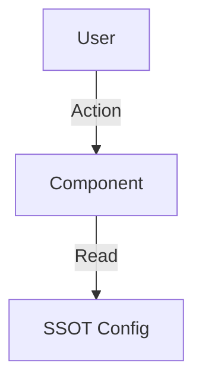

# [Topic Name] SSOT

> **SSOT Key**: `topic.unique_key` (e.g., `platform.sso`, `db.postgres`)
> **核心定义**：一句话定义该话题的单一真理来源是什么。

---

## 1. 真理来源 (The Source)

> **原则**：文档解释“为什么”，代码/配置定义“是什么”。不要在文档里硬编码易变的值。
<!-- 文件位置优于文字说明 -->
| 维度 | 物理位置 (SSOT) | 说明 |
|------|----------------|------|
| **服务定义** | `path/to/compose.yaml` | 资源声明源头 |
| **部署任务** | `path/to/deploy.py` | Invoke 任务入口 |
| **运行时状态** | **Vault** (`secret/<project>/<env>/...`) | 密钥与敏感配置 |
| **环境变量** | 远端 SSOT + `.env.example` | 变量契约 |

### Code as SSOT 索引

- **任务加载器**：参见 `tasks.py`
- **部署基类**：参见 `libs/deployer.py`

---

## 2. 架构模型

### 关键决策 (Architecture Decision)

- **决策点 1**：为什么选择 X 而不是 Y？
- **依赖关系**：本模块依赖 `L1 Bootstrap` 的 [xxx] 能力。
- **豁免规则**：是否存在打破 SSOT 的情况？(例如 Trust Anchor)

---

## 3. 设计约束 (Dos & Don'ts)

### ✅ 推荐模式 (Whitelist)

- **模式 A**：密钥先写入 Vault，再由部署流程读取。
- **模式 B**：关键步骤使用 `invoke` 任务封装，确保可重复。

### ⛔ 禁止模式 (Blacklist)

- **反模式 A**：**严禁**在 Git 代码中提交 `.env` 文件或明文密码。
- **反模式 B**：**禁止** 直接跳过 SSOT 修改线上配置。

---

## 4. 标准操作程序 (Playbooks)

### SOP-001: [任务名称，如：轮换数据库密码]

- **触发条件**：每 90 天 / 发生泄露事件
- **步骤**：
    1. 更新 Vault：`vault kv put secret/<project>/<env>/<service> password=...`
    2. 更新 Dokploy 环境变量并重启服务。
    3. 验证服务健康：`invoke <service>.shared.status`

### SOP-002: [任务名称，如：新增服务]

- **触发条件**：新服务上线
- **步骤**：
    1. 添加 `compose.yaml` 与 `deploy.py`。
    2. 运行 `invoke <service>.setup`。
    3. 更新相关 SSOT 文档。

---

## 5. 验证与测试 (The Proof)

| 行为描述 | 验证方式 | 覆盖率 |
|----------|----------|--------|
| **核心功能验证** | `invoke <service>.shared.status` | ✅ Manual |
| **异常恢复验证** | `docs/ssot/ops.recovery.md` | ⏳ Backlog |

---

## 引用指南 (How to Reference)

- **引用整体架构**：
  > 详见 `docs/ssot/platform.sso.md`。
- **引用特定 SOP**：
  > 执行 `docs/ssot/platform.sso.md#sop-001-新增-oidc-应用`。
- **引用设计约束**：
  > 根据 `docs/ssot/platform.sso.md#禁止模式-blacklist`，禁止提交 .env 文件。

---

## Used by

> **Note**: 本章节由 MkDocs 插件自动维护反向链接 (Backlinks)，无需人工编辑。
